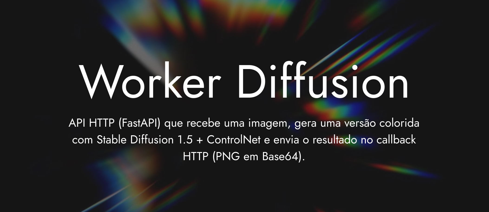

# Worker Diffusion

API HTTP (FastAPI) que recebe uma **lineart** (imagem), gera uma versão colorida com **Stable Diffusion 1.5** + **ControlNet lineart** e envia o resultado **apenas** no **callback** HTTP (PNG em Base64), **sem gravar** a imagem gerada em disco.

## Requisitos

- **GPU NVIDIA** recomendada (CUDA). Em CPU o serviço funciona com `float32`, mas é muito mais lento.
- **Docker** com [NVIDIA Container Toolkit](https://docs.nvidia.com/datacenter/cloud-native/container-toolkit/install-guide.html) para `gpus: all` no Compose.
- Espaço em disco para modelos Hugging Face (vários GB na primeira execução).

## Estrutura

```
worker-diffusion/
├── Dockerfile
├── docker-compose.yml
├── app/
│   ├── main.py
│   └── requirements.txt
└── data/                 # volume opcional (Compose): cache Hugging Face (.hf)
```

## Autenticação

Define a variável **`WORKER_DIFFUSION_API_KEY`** (valor secreto, longo e aleatório). Os clientes devem enviar o cabeçalho:

```http
X-API-Key: <o mesmo valor>
```

- **`POST /colorize_async`**: exige API key válida. Sem cabeçalho ou valor errado → **403**. Se o servidor não tiver `WORKER_DIFFUSION_API_KEY` definida → **503**.
- **`GET /health`**: sem API key (adequado a health checks de balanceadores/orquestração).

## Subir com Docker

Cria um ficheiro `.env` na raiz do projeto (junto ao `docker-compose.yml`), por exemplo:

```bash
WORKER_DIFFUSION_API_KEY=gere-um-segredo-longo-aleatorio
```

Depois:

```bash
docker compose build
docker compose up -d
```

- API: `http://localhost:1005`
- Health: `GET /health` — devolve `device` (`cuda` ou `cpu`) e se CUDA está disponível.

Primeira subida: o download dos pesos (`runwayml/stable-diffusion-v1-5`, `lllyasviel/sd-controlnet-lineart`) pode demorar.

## Endpoint

### `POST /colorize_async`

Cabeçalho obrigatório: `X-API-Key: <WORKER_DIFFUSION_API_KEY>`.

`multipart/form-data`:

| Campo | Tipo | Descrição |
|--------|------|-----------|
| `file` | arquivo | Imagem lineart (PNG/JPEG, etc.) |
| `prompt` | string | Prompt de colorização |
| `callback_url` | string | URL que receberá o JSON quando terminar |

Resposta imediata (202 não usado; corpo indica processamento assíncrono):

```json
{ "status": "processing", "filename": "nome-seguro.png" }
```

O nome do ficheiro é sanitizado (sem path traversal; extensão `.png` se faltar).

### Callback HTTP

`POST` para `callback_url` com JSON:

```json
{
  "filename": "nome-seguro.png",
  "image_base64": "<PNG em Base64>"
}
```

Cada `POST` ao callback usa timeout de **120 s**. Se a resposta **não** for de sucesso (código HTTP 2xx) ou ocorrer erro de rede, o worker **espera 60 s** e tenta de novo, até **4 pedidos no total** (1 tentativa inicial + **3 retries**). Se todas falharem, o erro final é registado no log. **Não** existe persistência do PNG no servidor: só memória + envio no callback.

## Variáveis de ambiente (Compose)

| Variável | Descrição |
|----------|-----------|
| `WORKER_DIFFUSION_API_KEY` | Segredo da API; obrigatório para usar `/colorize_async`. |
| `HF_HOME` | Diretório de cache Hugging Face (no Compose: `/app/data/.hf` no volume). |

## Desenvolvimento local (sem Docker)

Requer Python 3.10+, CUDA opcional.

```bash
cd worker-diffusion
python -m venv .venv
source .venv/bin/activate   # Windows: .venv\Scripts\activate
pip install -r app/requirements.txt
export WORKER_DIFFUSION_API_KEY="o-teu-segredo"
uvicorn app.main:app --reload --host 0.0.0.0 --port 1005
```

Executar estes comandos na **raiz** do repositório `worker-diffusion` (onde está a pasta `app/`).

## Notas

- **Segurança**: usa HTTPS em produção e rotação da API key se suspeitares de fuga. `callback_url` é chamado pelo servidor; em ambientes expostos à Internet, restrinja redes ou valide destinos para evitar SSRF.
- **GPU no Compose**: usa-se `gpus: all`. Se o teu Compose for antigo, pode ser necessário migrar para uma versão que suporte o campo `gpus` ou configurar o runtime NVIDIA manualmente.
